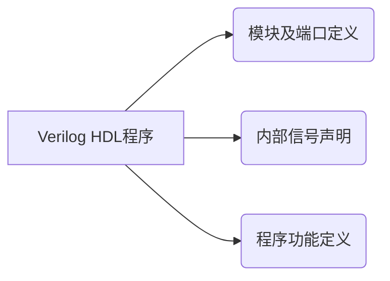

# Verilog HDL

Verilog HDL是描述硬件的语言，使用Verilog HDL编写代码，其实就是在抽象地绘制电路。

## 1 Verilog HDL简介

### 1.1 HDL（硬件描述语言）简介

HDL（Hardware Description Language）是一种以文本形式来描述数字系统硬件的结构和行为的语言。

用HDL可以表示逻辑电路图、逻辑表达式，复杂数字逻辑系统的逻辑功能；

用HDL编写设计说明文档易于存储和修改，并能被计算机识别和处理；

HDL输入方式的通用性和兼容性更好，便于移植；

HDL是高层次自动化设计的起点和基础。

目前， IEEE推出两种标准：VHDL和Verilog HDL

### 1.2 VHDL与Verilog HDL

|          |                             VHDL                             |                         Verilog HDL                          |
| :------: | :----------------------------------------------------------: | :----------------------------------------------------------: |
|   能力   |                        系统级抽象较强                        |          门级电路原理图描述方面（晶体管开关级）较强          |
| 设计类型 |              更适合特大型（千万门级）系统级设计              |        更适合系统级、算法及、RTL、门级电路原理图设计         |
| 数据类型 | 数据类型性极强，支持用户定义的数据类型，当对象的数据类型不一样时必须用类型转换函数转换，可以使用抽象（比如枚举）类型为系统建模，能利用数据类型检查编程的错误 | 数据类型简单，只能由语言本身定义，不能由用户定义，适于硬件结构的建模，不适于抽象的硬件行为建模 |
|  易学性  | 是一种数据类型很强的语言，欠直观。加之同一种电路有多种建模方法，通常需要一定的时间和经验，才能高效的完成设计。VHDL根植于ADA，有时简洁，有时冗繁，如行为描述简洁，结构描述冗繁。 | 由于Verilog为直接仿真语言，数据类型较简单，语法很直观，故Verilog更易理解和好学。Verilog更像C，约有50％的结构来自C，其余部分来自ADA。 |
|   效率   | 由于数据类型严格，模型必须精确定义和匹配数据类型，这造成了比同等地verilog效率要低。 | 不同位宽的信号可以彼此赋值，较小位数的信号可以从大位数信号中自动截取自己的位号。在综合过程中可以删掉不用的位，这些特点使之简洁，效率较高。 |

## 2 Verilog HDL的基本语法

### 2.1 程序结构

- 大约100个预定义的关键词
- Verilog HDL程序由模块构成。每个模块的内容都是嵌在关键词module和endmodule两个语句之间。每个模块实现特定的功能。
- 每个模块先要进行端口的定义，并说明输入（input) 、输出（output)和双向（inout)，然后对模块功能进行描述。
- 除了endmodule语句外，每个语句后必须有分号。
- 可以用/* --- */和//…..，对VerilogHDL程序的任何部分做注释。

每个Verilog HDL程序包括三个主要部分：模块及端口定义、内部信号声明、程序功能定义



1. 模块及端口定义

2. 内部信号声明：

    - Verilog HDL有两种最基本的信号类型：wire（线网）和reg（寄存器）
    - 在端口声明中，如果对信号类型不做说明，默认为wire（建议对信号类型都作说明）
    - 寄存器类型的信号用reg表示
    - 在always模块内部中**被赋值的信号**必须为reg类型（always模块介绍参见下文）

3. 程序功能定义

    - 关键字assign
    
    - 通过元件
          //示例： and u1(c,a,b)
          // and：元件名；u1：是一个实例化的名字或标识符（必须唯一）
    
    - 关键字always：主要用于描述组合逻辑电路，也可以描述时序逻辑电路
    
      ```verilog
      module ...(
          ...);
      //以上是模块与端口定义
      reg f; //在always模块内部中被赋值的信号必须为reg类型
      //具有异步清零的D触发器，rst 清零信号  d 输入信号  q 输出信号  clk 时钟信号 
      // posedge 是一个关键字，用于表示时钟信号的上升沿（positive edge）
      always @(posedge clk or posedge rst)
          begin
              if(rst) f<=0;
              else f<=a;
          end
      ```
      
      

示例：

```verilog
//模块定义
module exam01(
	input a,
	input b,
	input c,
	input d);
//内部信号说明：无
//程序功能定义：
	assign c = a&b;
	assign d = a|b;

endmodule
```


模板：

```verilog
//模块定义
module exam01(
//端口定义   
    //端口类型说明(input,output,inout)
    input ...,
    ...
    output ...);
//内部信号说明
    ...
    //参数定义(可选)
    
    //数据类型定义(可选)
    wire wire1,wire2;

    //程序功能定义/描述逻辑功能(主要有3种定义/描述方式)
    //1.assign(连续赋值语句)
    assign ...;
    
	//2.通过元件
    //示例： and u1(c,a,b)
    // and 元件名 u1 是一个实例化的名字或标识符（必须唯一）
    
    //3.always
    always @(...)
        begin
            ...
            ...
        end
    //4.块语句
    initial begin//过程块结构
        ...//行为描述语句
    end    

endmodule
```

### 2.2 数据类型及基本运算符

1. 数据类型

  - 常用的数据类型：

  - wire 线网，表示组合逻辑电路的信号

  - reg 寄存器数据类型（并非reg类型的信号一定是寄存器或触发器的输出）

  - time 时间数据类型

  - parament 定义参数类型，可以定义一个标识符来表示一个常量，称为符号常量

2. 常量与变量

   - 常量

     ```verilog
     parament data0 = 8'b10101100 //定义常量data0 值为8bit的二进制数10101100
     ```

   - 变量 最重要的有wire和reg

     ```verilog
     wire [3:0] cn4=0 //定义位宽为4bit的wire型变量 赋初值为0
     reg [4:0] cn5=10
     ```

3. 运算符与表达式

   

### 2.3 运算符优先级与关键词


### 2.4 赋值语句与块语句

#### 2.4.1 赋值语句

1. 阻塞赋值 (=)：
   - 赋值语句执行完后变量的值立即改变
   - 可以用在assign语句（描述组合逻辑电路）和always语句（描述组合和时序逻辑电路）中

2. 非阻塞赋值 (<=)：
   - 上一条语句所赋值的变量不能立即被下一条语句使用，块语句结束后才可以完成
   - 只能用在always、initial语句中，其中initial语句只在测试激励文件中使用
   - 建议在always语句中只使用 <=

#### 2.4.2 块语句

1. begin···end 顺序块

   - 如果顺序块中的语句之间没有直接的逻辑关系，比如if···else，则仍然是并行执行，且可以交换顺序

2. fork···join 并行块 只能用在测试激励文件中

3. 差异比较：

   ```verilog
   //顺序块生成测试信号clr的代码
   initial
   begin
       clr = 0;		//上电时，从起始时刻算起，clr = 0
       #10 clr=1;		//10个时间单位后，clr = 1
       #20 clr=0;		//30个时间单位后，clr = 0
       #30 clr =1;		//60个时间单位后，clr = 0
   end
   ```

   ```verilog
   //并行块生成测试信号clr的代码
   initial
   fork
       clr = 0;		//上电时，从起始时刻算起，clr = 0
       #10 clr=1;		//10个时间单位后，clr = 1
       #20 clr=0;		//20个时间单位后，clr = 0
       #30 clr =1;		//30个时间单位后，clr = 0
   join
   ```

### 2.5 条件语句和分支语句

**类比C语言**

#### 2.5.1 条件语句 if···else

​	有优先级的选择语句

#### 2.5.2 分支语句 case

​	没有优先级的选择语句

## 3 Verilog HDL程序设计及示例


